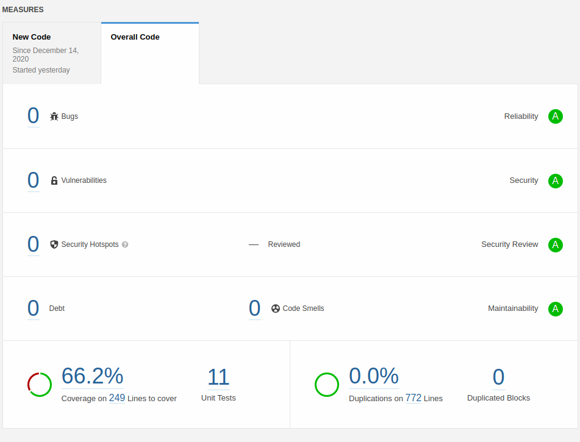
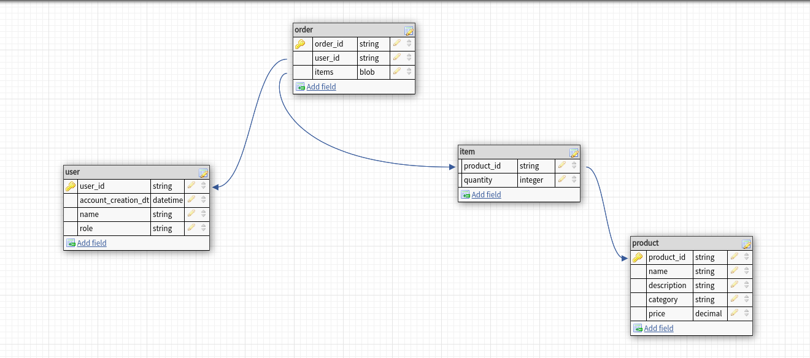

# retail-billing

Project built to apply discounts on user bill.

# Key Features:

1. SonarQube report for the code quality summary and covearage.
2. Junit5 and Mockito for unit testing.
3. Swagger UI Documentation.
4. @RestControllerAdvice for Global Exception handling.
5. spring-validation to validate request and response.
6. Code written following industry standards(whereever applicable).
7. Last but not least, nearly production ready code.


# Rules to apply discount:

1. If the user is an employee of the store, he gets a 30% discount
2. If the user is an affiliate of the store, he gets a 10% discount
3. If the user has been a customer for over 2 years, he gets a 5% discount.
4. For every $100 on the bill, there would be a $ 5 discount (e.g. for $ 990, you get $ 45 as a discount).
5. The percentage based discounts do not apply on groceries.
6. A user can get only one of the percentage based discounts on a bill.

## Assumptions:

 Discounts to be applied sequentially i.e; after applying percentage discounts(if applicable), $5 discount is applied on previously discounted value.

 **Example:**

 If User is of type **Employee**  and bill on groceries is $240.04 and bill on non-grocery items is $50. Total bill is calculated as below.

 a. First apply employee discount of 30% on non-grocery items i.e non-grocery bill = 50 -50*0.3 = $35.

 b. Total bill currently = 35 + 240.04 = $275.04.

 c. Apply $5 discount on every $100 value i.e; total bill = $275.04 - 5*2 = 265.04

 # Steps to run code:

 **Requirements:**
 1. Java 11 and maven 3.3+.
 2. Standalone sonarqube installed locally.

 ## Build project :

 From root directory of code,


 **1. with test cases :** 
 ```
 mvn clean install 
 ```

 **2. without test cases :**
 ```
 mvn clean install -DskipTests
 ```


 ## Build project with sonarqube:
 ```
 mvn clean install sonar:sonar -Dsonar.login={username} -Dsonar.password={password}
 ```

 <br><br>

 ## Run project:
```
 mvn spring-boot:run
 ```


 # Swagger UI Docs:

 http://localhost:8080/swagger-ui.html

 # Retail billing API:

 **URL:** /api/v1/billing

 **Sample Request:**

 {

    "orderId": "ab1d4f67-3b65-4222-a3f7-cfe603f18545",
    "userId": "ab1d4f67-3b65-4222-a3f7-cfe603f1859a",
    "items": [
        {
            "productId": "e8811e36-231b-4dcd-bcfa-701c09938f64",
            "quantity": 2
        },
        {
            "productId": "6ad0a278-8cc9-460d-bea5-7607ea9f0399",
            "quantity": 1
        }
    ]

}

**Corresponding response :**

{

    "orderId": "ab1d4f67-3b65-4222-a3f7-cfe603f18545",
    "userId": "ab1d4f67-3b65-4222-a3f7-cfe603f1859a",
    "billingAmount": 265.08000000000004,
    "statusMessage": "final bill generated successfully"

}

**NOTE:** Few more sample requests are in docs folder.

# Relation between key entities:

 <br><br>


